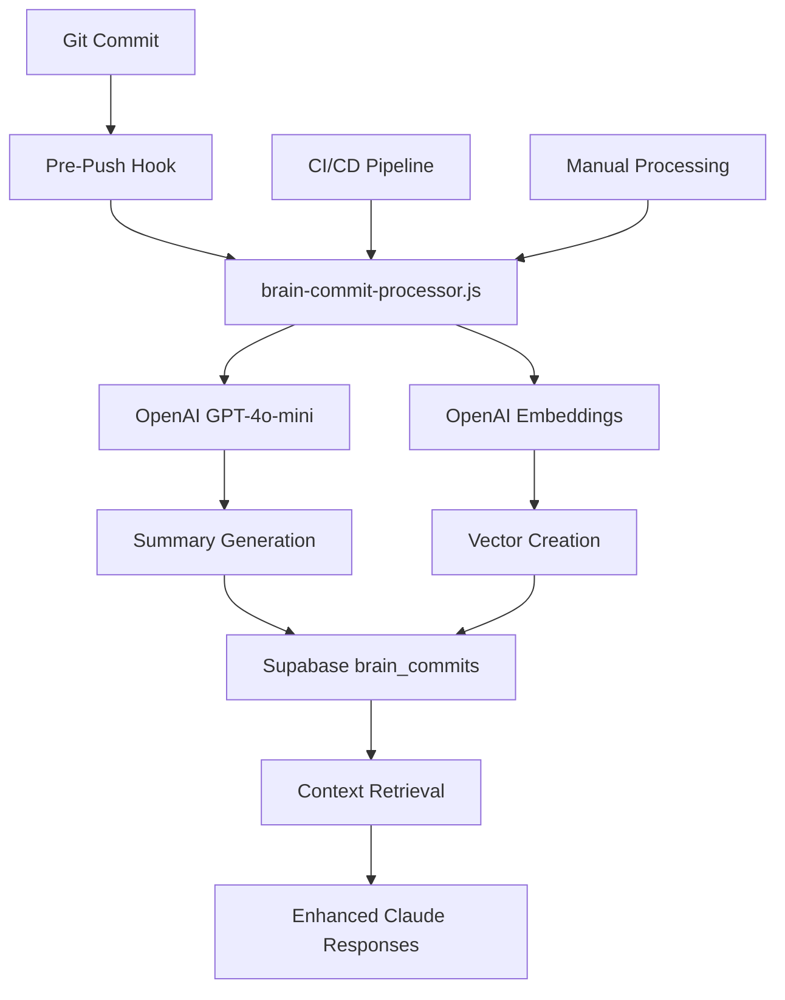

# 🧠 SISO Self-Updating Context Engine

## Overview

The Self-Updating Context Engine automatically processes Git commits to generate summaries and embeddings, providing Claude with enhanced context about your codebase. This system eliminates the need for manual context gathering and makes AI assistance more intelligent and project-aware.

## 🎯 Problem Solved

**Before:** Manual context sharing with Claude
- Copy-paste files for every question
- Explain project structure repeatedly  
- Claude lacks awareness of recent changes
- Time-consuming back-and-forth conversations

**After:** Automatic context intelligence
- Claude knows your codebase patterns
- Understands recent changes automatically
- Provides context-aware suggestions
- 10× faster development workflow

## 🏗️ Architecture



## 📦 Components

### 1. Database Layer
- **pgvector Extension**: Vector similarity search
- **brain_commits Table**: Stores commit metadata and embeddings

### 2. Processing Pipeline
- **brain-commit-processor.js**: Core processing script
- **Git Pre-Push Hook**: Automatic triggering
- **GitHub Actions**: CI/CD fallback processing

### 3. AI Integration
- **OpenAI GPT-4o-mini**: Generates technical summaries
- **text-embedding-3-small**: Creates semantic embeddings
- **Supabase**: Vector storage and retrieval

## 🚀 Getting Started

### Prerequisites
```bash
# Required environment variables
OPENAI_API_KEY=sk-...
VITE_SUPABASE_URL=https://...
VITE_SUPABASE_ANON_KEY=eyJ...
```

### Installation
```bash
# 1. Install Git hooks
./scripts/install-git-hooks.sh

# 2. Manual processing (optional)
node scripts/brain-commit-processor.js HEAD

# 3. Process multiple commits
node scripts/brain-commit-processor.js HEAD~5
```

## 📋 Usage

### Automatic Processing (Recommended)
Every `git push` automatically processes commits:
```bash
git commit -m "Add new authentication feature"
git push origin dev

# Output:
# 🧠 SISO Context Engine: Processing commits for Claude...
# ✅ Successfully processed commit abc123f8
# 🎉 Context engine updated!
```

### Manual Processing
```bash
# Process specific commit
node scripts/brain-commit-processor.js abc123f

# Process latest commit
node scripts/brain-commit-processor.js HEAD

# Process range of commits
for commit in $(git log --format="%H" -n 5); do
  node scripts/brain-commit-processor.js $commit
done
```

### CI/CD Integration
- **Automatic**: Triggers on push to `main`/`dev` branches
- **Manual**: Run via GitHub Actions workflow_dispatch
- **Pull Requests**: Adds context summary comments

## 🗄️ Database Schema

```sql
CREATE TABLE brain_commits (
  id UUID PRIMARY KEY DEFAULT gen_random_uuid(),
  commit_hash TEXT UNIQUE NOT NULL,
  commit_message TEXT,
  summary TEXT,
  embedding VECTOR(1536),
  committed_at TIMESTAMPTZ DEFAULT now()
);
```

## 🔧 Configuration

### Environment Variables
| Variable | Description | Required |
|----------|-------------|----------|
| `OPENAI_API_KEY` | OpenAI API key for GPT-4o-mini and embeddings | ✅ |
| `VITE_SUPABASE_URL` | Supabase project URL | ✅ |
| `VITE_SUPABASE_ANON_KEY` | Supabase anonymous key | ✅ |

### Git Hook Settings
- **Commit Limit**: Processes up to 5 commits per push
- **Error Handling**: Non-blocking (never interrupts workflow)
- **Duplicate Detection**: Skips already-processed commits

### CI/CD Settings
- **Triggers**: Push to main/dev, manual dispatch
- **Commit Range**: Configurable (default: 5 recent commits)
- **Secrets Required**: All environment variables

## 🎯 Benefits

### For Developers
- **Faster Context**: No manual file copying
- **Smarter AI**: Claude understands your patterns
- **Zero Interruption**: Non-blocking processing
- **Team Onboarding**: New developers get instant context

### For Claude
- **Project Awareness**: Knows your architecture
- **Historical Context**: Understands past decisions
- **Pattern Recognition**: Learns your coding style
- **Semantic Search**: Finds relevant past work

## 🔍 Troubleshooting

### Common Issues

**Environment Variables Missing**
```bash
# Check if variables are set
echo $OPENAI_API_KEY
echo $VITE_SUPABASE_URL
echo $VITE_SUPABASE_ANON_KEY
```

**Git Hook Not Running**
```bash
# Check if hook is executable
ls -la .git/hooks/pre-push

# Reinstall hooks
./scripts/install-git-hooks.sh
```

**Processing Failures**
```bash
# Test manual processing
node scripts/brain-commit-processor.js HEAD

# Check API keys and network
curl -H "Authorization: Bearer $OPENAI_API_KEY" \
     https://api.openai.com/v1/models
```

### Debug Mode
```bash
# Run with detailed output
node scripts/brain-commit-processor.js HEAD 2>&1 | tee debug.log
```

## 📊 Monitoring

### Check Processing Status
```sql
-- View recent processed commits
SELECT 
  commit_hash,
  commit_message,
  summary,
  committed_at
FROM brain_commits 
ORDER BY committed_at DESC 
LIMIT 10;

-- Count total processed commits
SELECT COUNT(*) as total_commits FROM brain_commits;
```

### GitHub Actions
- Monitor workflow runs in GitHub Actions tab
- Check CI/CD logs for processing summaries
- Review PR comments for context updates

## 🔮 Future Enhancements

### Ideas 2-5 from the original plan:
1. **Prompt-Aware Retrieval Middleware**: `/api/brain/search?q=` endpoint
2. **Autonomous Task Generator**: Auto-create tasks from PR merges
3. **Real-Time Schema Mirror**: Auto-generate TypeScript types
4. **Dark-Theme Component CLI**: Pre-styled component library

### Advanced Features
- **Selective Processing**: Filter commits by patterns
- **Custom Summarization**: Domain-specific prompts
- **Integration APIs**: Slack, Discord notifications
- **Analytics Dashboard**: Processing metrics and insights

## 📚 API Reference

### brain-commit-processor.js
```bash
# Usage
node scripts/brain-commit-processor.js [commit-hash]

# Examples
node scripts/brain-commit-processor.js              # Process HEAD
node scripts/brain-commit-processor.js abc123f      # Process specific commit
node scripts/brain-commit-processor.js HEAD~1       # Process previous commit
```

### Git Hook
- **Trigger**: `git push`
- **Processing**: Automatic, non-blocking
- **Output**: Colorized terminal feedback
- **Error Handling**: Graceful fallback

### CI/CD Workflow
- **File**: `.github/workflows/context-engine.yml`
- **Triggers**: Push, PR, manual dispatch
- **Features**: Environment validation, PR comments, documentation updates

## 🤝 Contributing

### Adding New Features
1. Update `brain-commit-processor.js` for new processing logic
2. Modify Git hook if trigger behavior changes
3. Update CI/CD workflow for new integrations
4. Add tests and documentation

### Testing
```bash
# Test processing script
npm test

# Test Git hook (dry run)
.git/hooks/pre-push origin https://github.com/user/repo < /dev/null

# Test CI/CD locally with act
act -j process-commits
```

---

**🎉 The Self-Updating Context Engine transforms Claude from a generic assistant into a project-aware expert that knows your codebase as well as you do!** 